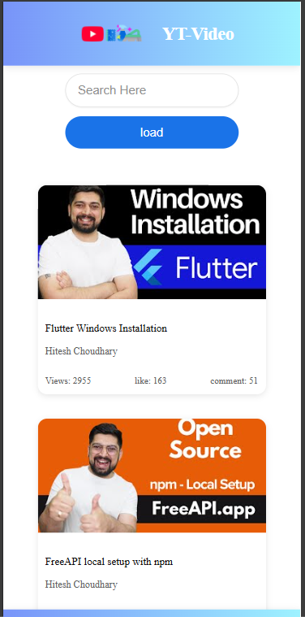

# YT-Video Browser

A clean and modern web application for browsing YouTube videos. This application fetches video data from YouTube's API and displays them in an attractive card layout with search functionality.

## Features

- **Video Card Display**: Clean, responsive cards showing video thumbnails and information
- **Search Functionality**: Real-time search with throttling for optimal performance
- **Video Statistics**: View counts, likes, and comments for each video
- **Responsive Design**: Optimized for both desktop and mobile devices
- **Direct YouTube Links**: Click on any video card to open the original YouTube video

## Screenshots

### Desktop View


### Mobile View



### Search Functionality


## Technology Stack

- **Frontend**: HTML5, CSS3, JavaScript (vanilla)
- **API**: YouTube Data API via freeapi.app
- **Performance**: Implemented throttling for search optimization

## Setup and Installation

1. Clone the repository:

   ```
   https://github.com/Tejas-Dherange/youtube-video-listing.git
   ```

2. Navigate to the project directory:

   ```
   cd youtube-video-listing
   ```

3. Open `index.html` in your browser or use a local server like Live Server extension in VS Code.

## How to Use

1. When the page loads, videos will be automatically fetched and displayed
2. Use the search bar to filter videos by title
3. Click on any video card to watch the video on YouTube

## Deployment

The application is deployed and can be accessed at:https://youtube-video-listing-git-main-tejas-dheranges-projects.vercel.app/

## Future Enhancements

- Add pagination for loading more videos
- Implement video categorization
- Add dark mode toggle
- Improve accessibility features
- Add user authentication for personalized recommendations

## License

This project is licensed under the MIT License - see the LICENSE file for details.

## Acknowledgments

- YouTube Data API
- freeapi.app for providing the API endpoint
